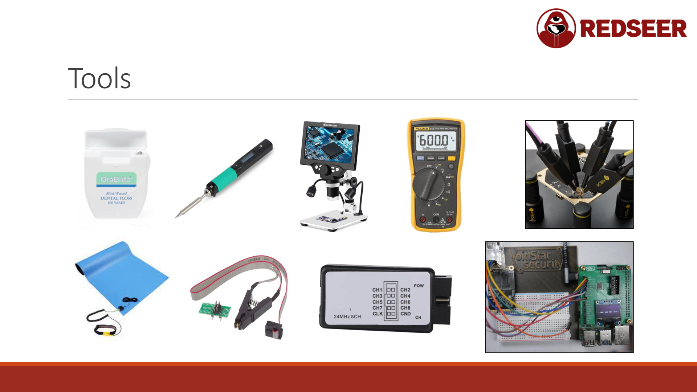

# Hardware Hacking Tools and Equipment



Building a hardware hacking kit is like building any other toolkit: start with what you need for your current project, then expand as you take on more complex challenges. Buy what you need, outgrow it, then buy the next thing.

## Physical Tools

### Soldering Iron (Essential)

You will need a soldering iron. It doesn't need to be expensive. The Pinecil is an excellent budget option, often $30-50 USD. It's compact, heats quickly, and is reliable.

Look for:
- Temperature control (350-450 degrees Celsius)
- Small, fine tip for micro-soldering
- Portable if you work at multiple locations
- USB power is nice but not required

**When you might need it:** Removing and installing header pins, repairing solder bridges, replacing components, desoldering connections

### Microscope (Highly Recommended)

A digital USB microscope ($20-100) is perhaps the single most valuable tool. You cannot hack what you cannot see.

Why it matters: Chips are tiny. Labels are small. Solder bridges are invisible to the naked eye. A microscope reveals everything.

Look for:
- At least 40x magnification (USB digital is common)
- Good lighting (built-in LED)
- Stable mounting (on a stand, not handheld)
- USB connection to view on your computer

**When you might need it:** Reading chip labels, identifying trace connections, spotting solder errors, finding tiny test points

### Multimeter (Essential)

A true RMS multimeter is essential. Do not buy the cheapest options; they give inaccurate readings.

Expect to spend $20-50 for a quality basic multimeter. It tests:
- Voltage (DC and AC)
- Current (up to certain limits)
- Resistance and continuity
- Temperature (in some models)

**When you might need it:** Checking power supply voltages, testing for shorts, verifying signal presence, continuity checking

### ESD Mat and Wrist Strap (Important)

Electrostatic discharge destroys silicon chips instantly. In low-humidity areas, ESD protection is critical. In Florida (high humidity), it matters less, but you should still use it.

A basic ESD mat and wrist strap costs $15-30. When working, you sit the device on the mat, put on the wrist strap, and both connect to ground.

**When you might need it:** Any time you're handling bare PCBs or working with CMOS chips

### Dental Floss (Cheap and Useful)

Yes, dental floss. Use it to carefully lift heatsinks off chips without damaging traces. Slide it underneath and work it back and forth gently. It removes thermal paste and gets the heatsink off without scratching the board.

Cost: $2-5 for a lifetime supply.

### PCBite Probes (Optional but Useful)

PCBite probes are tiny magnetic hooks that attach to surfaces without soldering. They allow you to tap into tiny pins for short connections.

Look for:
- Magnetic attachment
- Thin, sharp tips
- Multiple colors (for different signals)

Cost: $50-100 for a set

This is a "nice to have" tool. You can improvise with careful soldering or pin clamps for now.

### Chip Clip / SOIC Clip (Optional)

A chip clip attaches directly to a flash chip without soldering. It's useful for reading SPI flash without desoldering.

Cost: $20-50

However, clipping can be unreliable depending on the chip package. Many hackers just solder temporary wires or use a logic analyzer with direct probing.

## Digital Tools (Software)

All tools mentioned here are free or open source and run on Linux.

### Screen and Minicom (UART Communication)

Terminal multiplexer and serial communicator. Both come with most Linux distributions.

```bash
# Using screen to connect to a serial port at 57600 baud
screen /dev/ttyUSB0 57600

# Using minicom (configure via: minicom -s)
minicom -D /dev/ttyUSB0 -b 57600
```

Exit screen with Ctrl-A K (kill session) or Ctrl-A D (detach and leave running).

### Flashrom (SPI Flash Dumping)

Flashrom is the standard tool for reading and writing SPI flash chips. It supports countless chip models and automatically detects many.

Install: `sudo apt install flashrom`

Read a flash chip:
```bash
sudo flashrom -p linux_spi:dev=/dev/spidev0.0,spispeed=8000 -r dump.bin
```

### OpenOCD (JTAG/SWD Debugging)

OpenOCD provides a unified interface to debug interfaces. It connects to SWD and JTAG adapters and allows you to halt the CPU, dump memory, read flash, and even modify running code.

Install: `sudo apt install openocd`

Connect via telnet after starting OpenOCD:
```bash
telnet localhost 4444
```

### Ghidra (Firmware Disassembly)

Ghidra is the NSA's free reverse engineering tool. It disassembles binary firmware into readable assembly and pseudo-code.

Installation: Download from https://ghidra-sre.org/

With the CMSIS SVD loader plugin, Ghidra can understand ARM chip memory maps, making firmware analysis dramatically easier.

### xxd (Hex Dumps)

xxd displays binary files in hexadecimal and ASCII, useful for quickly scanning a firmware dump.

```bash
xxd firmware.bin | head -100
```

## The PiFex: Raspberry Pi Hardware Hacking HAT


The PiFex is a game-changing tool. It's a Raspberry Pi HAT (hardware attached on top) that turns your Pi into a complete hardware hacking platform.

What it adds:
- Native JTAG and SWD support (debugging interfaces)
- Adjustable voltage output (sub-3.3V for lower-voltage chips)
- Integrated logic analyzer connection
- Pre-configured Raspberry Pi image (based on Raspberry Pi OS)
- SSH and Telnet access over network or USB

Cost: Around $75 USD

Why it's excellent:
- All interfaces pre-wired and labeled
- No custom configuration needed
- Headless operation (no monitor needed)
- Can be used from another computer over the network
- Includes the logic analyzer connection on the board itself

**How to use it:**

1. Flash the PiFex image to a microSD card
2. Insert card into Raspberry Pi 4
3. Attach the PiFex hat
4. Connect USB to your computer or plug into your network
5. The small display shows the IP address
6. SSH into it: `ssh pi@<IP_ADDRESS>`
7. Use flashrom, OpenOCD, or logic analyzers as if the Pi were local

Setup is already done for you. The pins are labeled. The tools are installed. You just connect your target device and start hacking.

## Logic Analyzer (Entry Level)

A cheap logic analyzer ($10-20 from AliExpress or Amazon) is sufficient for capturing UART and SPI traffic.

What you get:
- 8+ channels
- Sampling up to 24 MHz typically
- USB connection
- Software to decode protocols (UART, SPI, I2C, etc)

What you lose compared to expensive logic analyzers:
- Speed (you cannot capture very fast signals)
- Storage (limited capture depth)
- Reliability (some knockoffs have issues)

But for educational purposes and most hobby hacking, they work fine. Capture a UART boot sequence, measure baud rate, sniff SPI traffic. These analyzers do all of that.

The PiFex includes a logic analyzer connection, making it even more convenient.

## Oscilloscope (Nice to Have)

An oscilloscope shows you analog signals in detail. It answers: "What's the voltage doing over time?"

Budget oscilloscopes:
- Cheap handheld: $50-200 (often unreliable, slow)
- Entry level digital: $300+

This is not essential for most firmware hacking but is useful for:
- Verifying signal integrity
- Measuring timing
- Detecting noise or glitches
- Understanding analog circuits

Most people start without one. When you hit a problem that needs it, you know to buy one.

## Getting Started: The Recommended Starter Kit

If you're building a kit from scratch, buy in this order:

1. **Raspberry Pi 4 ($50-100)** - The foundation
2. **USB to Serial adapter ($5-10)** - For UART
3. **Jumper wires assortment ($5-10)** - Connections
4. **Logic analyzer ($10-20)** - See what's happening
5. **Multimeter ($20-30)** - Check voltages
6. **USB microscope ($30-50)** - Read labels
7. **PiFex ($75)** - When you're serious
8. **Soldering iron + solder ($30-50)** - For soldering work

Total starting budget: $150-250 gets you most of what you need.

Expensive tools to skip early: oscilloscopes, high-end logic analyzers, commercial-grade ProgrammersIf your project needs them, you'll know when.

## Alternatives and Substitutes

### Bus Pirate 6

The Bus Pirate is an older, popular hardware hacking tool. It supports I2C, SPI, UART, and other protocols. It's simpler than PiFex but less integrated.

Pro: Straightforward, been around forever, large community
Con: Slower, more setup, fewer integrated features

Cost: $50-100

### DIY Solutions

You can build many tools yourself:
- SPI flasher using a parallel port adapter
- JTAG adapter using a cheap FTDI chip
- Logic analyzer using a Raspberry Pi GPIO

These require soldering and configuration but cost almost nothing.

## Philosophy: Buy What You Need, Outgrow It

The key principle is this: buy a tool for a specific project. Learn that tool completely. Discover its limitations. Then, when you hit a wall, you know exactly what you need next.

Many people buy expensive tools hoping to "get into" hardware hacking and never use them. Instead, start cheap. Do a project. Figure out what the next barrier is. Buy something that removes that barrier.

Over time, you build a kit specifically matched to the problems you solve. It's more cost-effective and you actually use everything you own.
