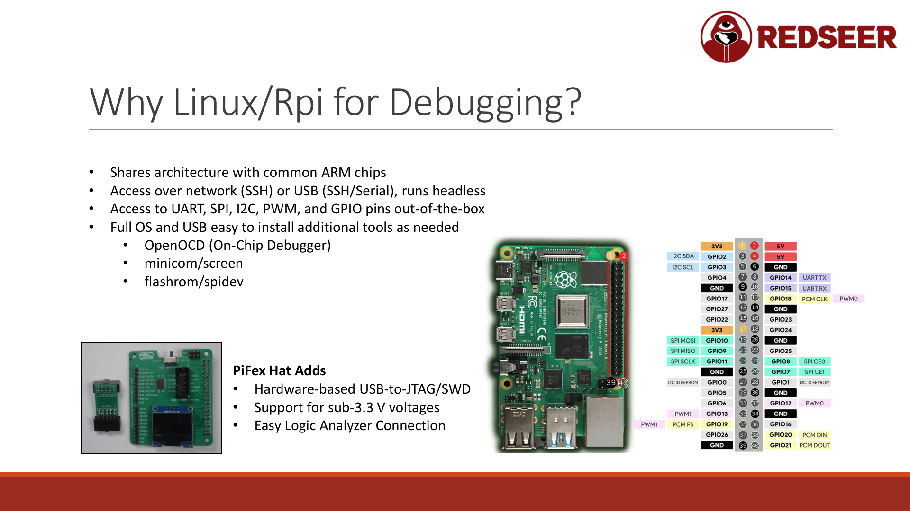

# Linux and Raspberry Pi Setup for Hardware Hacking



## Why Linux and Raspberry Pi?

### ARM Architecture Alignment

The Raspberry Pi uses ARM architecture. Most IoT devices and embedded systems also use ARM. When you're hacking an ARM-based device on an ARM-based platform, you can use the same tools, scripts, and even compiled binaries across systems.

This matters for:
- Testing compiled code before flashing
- Running the same debugging tools on both your hack platform and target
- Understanding memory layouts and register structures
- Moving code between environments

### Full Operating System

The Raspberry Pi runs Linux. That means you have:
- Full shell access
- All standard Linux tools (grep, sed, awk, hexdump, xxd)
- Package managers for installing what you need
- SSH for remote access
- USB mounting and file system access
- Cron for automation

This is radically different from Windows-only tools. Linux gives you the complete toolkit.

### Native Interface Support

Out of the box, the Raspberry Pi GPIO (general purpose input/output) pins provide:
- UART (serial) - Hardware serial port for boot consoles
- SPI - Serial Peripheral Interface for flash chips
- I2C - Inter-Integrated Circuit for sensors
- PWM - Pulse Width Modulation
- GPIO - Digital input/output

You don't need special adapters for these. They're built in.

### Remote Access: SSH and USB

You can access the Raspberry Pi two ways:

1. **SSH over network** - Plug the Pi into Ethernet (or WiFi), connect over SSH from any computer
2. **USB** - Plug USB directly into your main computer; the Pi shows up as a serial device

This means you can:
- Hack at your workbench while controlling the Pi from your desk
- Use the Pi in one location and your main computer in another
- Work over SSH from anywhere (including from inside other hacks)

### Tools Available in Linux

All the hardware hacking tools mentioned in the previous chapter run on Linux:

- **Screen and Minicom** - Serial communication
- **Flashrom** - SPI flash dumping
- **OpenOCD** - JTAG/SWD debugging
- **Ghidra** - Disassembly and reverse engineering
- **Logic analyzer software** - Protocol decoding
- **Custom scripts** - You can write Python, C, shell scripts to automate testing

## The PiFex: GPIO on Steroids

The PiFex HAT takes the Raspberry Pi's native capabilities and enhances them:

### Voltage Adjustment

Some chips operate at 1.8V or 2.5V, not the standard 3.3V. The PiFex includes a voltage switch that lets you:
- Feed any voltage (1.8V to 5V) into the chip
- Use dual bidirectional level shifters to communicate at that voltage

This allows you to hack modern, lower-voltage chips that standard GPIO cannot directly connect to.

### JTAG and SWD Support

The PiFex adds native support for JTAG and SWD (Single Wire Debug) interfaces. These are the primary debugging interfaces on ARM chips.

Pin layout includes pre-wired headers for:
- SWD (3 wires: SWDIO, SWDCLK, Ground)
- JTAG (4+ wires: TDI, TDO, TCK, TMS, Ground)
- Target voltage

### Logic Analyzer Connection

The PiFex has a dedicated logic analyzer port, allowing you to:
- Capture signals directly to the Pi
- Analyze protocols with Pulseview software
- Store captures for later analysis

This integration means you don't need external USB devices. Everything connects to the Pi.

### Pre-Configured Image

Void Star Security provides a PiFex-specific image based on Raspberry Pi OS. It includes:
- All required drivers
- OpenOCD pre-installed and configured
- Flashrom ready to use
- GPIO pinout diagrams in the file system
- Example configuration files

Download the image from the Void Star Security GitHub, flash it to a microSD card, and you're ready to hack. Nothing to configure.

## Standard Raspberry Pi GPIO Pinout

If you're using a standard Raspberry Pi without the PiFex, here's what you have available:

```
UART:
- GPIO 14 (TXD)
- GPIO 15 (RXD)
- /dev/ttyAMA0 (hardware UART)

SPI:
- GPIO 10 (MOSI)
- GPIO 9 (MISO)
- GPIO 11 (CLK)
- GPIO 8 / GPIO 7 (CE0 / CE1)
- /dev/spidev0.0 (default device)

I2C:
- GPIO 2 (SDA)
- GPIO 3 (SCL)
- /dev/i2c-1 (default device)
```

Detailed pinout diagrams are available at pinout.xyz and in the PiFex documentation.

## Setting Up a Raspberry Pi for Hardware Hacking

### Step 1: Get the Image

For PiFex:
```bash
# Download from Void Star Security
# Flash to microSD with Balena Etcher or dd
sudo dd if=pifex-image.img of=/dev/sdb status=progress
```

For standard Raspberry Pi OS:
```bash
# Download from raspberrypi.com
# Flash with Balena Etcher (GUI) or dd (CLI)
```

### Step 2: Install Required Tools

If using standard Raspberry Pi OS (not PiFex):

```bash
sudo apt update
sudo apt install -y flashrom openocd screen minicom

# For logic analyzer support
sudo apt install -y pulseview sigrok

# For development
sudo apt install -y git python3-pip
```

### Step 3: Enable Interfaces

Some interfaces are disabled by default. Enable them:

```bash
# Interactive configuration
sudo raspi-config

# Enable under Interfacing Options:
# - SSH (for remote access)
# - Serial (for UART)
# - SPI (for flashrom)
# - I2C (for I2C devices)
```

Or edit /boot/config.txt directly:

```
# Add these lines
dtparam=spi=on
dtparam=i2c_arm=on
enable_uart=1
```

### Step 4: Set Up SSH Keys (Optional but Recommended)

Generate a key on your main computer:

```bash
ssh-keygen -t ed25519 -f ~/.ssh/pi_rsa
```

Copy the public key to the Pi:

```bash
ssh-copy-id -i ~/.ssh/pi_rsa.pub pi@<IP_ADDRESS>
```

Now you can SSH without a password:

```bash
ssh -i ~/.ssh/pi_rsa pi@<IP_ADDRESS>
```

### Step 5: Mount Pi Filesystem on Main Computer

If you want to edit files or transfer firmware locally:

```bash
# SSH mount (Linux/Mac)
sshfs pi@192.168.1.100:/home/pi /mnt/pi

# Transfer files
scp -i ~/.ssh/pi_rsa firmware.bin pi@192.168.1.100:/home/pi/
```

## USB Serial Connection

If you don't have network access or prefer direct USB:

```bash
# Plug Pi directly to computer via USB
# On Raspberry Pi, open /boot/config.txt and set:
dtoverlay=dwc2

# On main computer, find the device
dmesg | grep -i "usb"

# Connect via screen
screen /dev/ttyACM0 115200
```

## Accessing GPIO Pins

To read and write GPIO directly without soldering, use Python:

```python
import RPi.GPIO as GPIO

GPIO.setmode(GPIO.BCM)
GPIO.setup(4, GPIO.IN)  # Pin 4 as input
GPIO.setup(17, GPIO.OUT)  # Pin 17 as output

# Read a pin
if GPIO.input(4):
    print("Pin 4 is HIGH")

# Write a pin
GPIO.output(17, GPIO.HIGH)
GPIO.output(17, GPIO.LOW)

GPIO.cleanup()
```

Or use the newer gpiod library:

```bash
gpiodetect
gpioinfo
gpioset gpiochip0 17=1
```

## Testing Your Setup

Once the Pi is configured, test each interface:

### Test UART

Connect a USB-to-serial adapter or target device:

```bash
# Monitor the serial port
screen /dev/ttyUSB0 115200

# Send data (press Ctrl-A, then type text)
# Exit with Ctrl-A K
```

### Test SPI

Connect an SPI flash chip or logic analyzer:

```bash
# Test SPI device detection
sudo flashrom -p linux_spi:dev=/dev/spidev0.0,spispeed=8000 -L

# Should list compatible chips
```

### Test I2C

```bash
# Scan for I2C devices
i2cdetect -y 1

# Should show addresses of connected devices
```

## Performance Notes

The Raspberry Pi is not the fastest platform. Expect:
- Flashrom operations: 30 seconds to several minutes depending on chip size
- OpenOCD halting the CPU: Instant
- Firmware dumps: Minutes for large flash chips
- Logic analysis: Works well up to the Pi's GPIO speed limits

For most hobby hacking, the Pi is more than adequate. If you need gigahertz-speed signal capture, you'd buy an expensive logic analyzer. For firmware extraction and debugging, the Pi is perfect.

## Next Steps

Once your Pi is set up:

1. Connect to your first target device
2. Use screen to find the UART boot console
3. Identify the flash chip
4. Use flashrom to dump the firmware
5. Analyze it with Ghidra

These steps are covered in detail in the chapters that follow.
