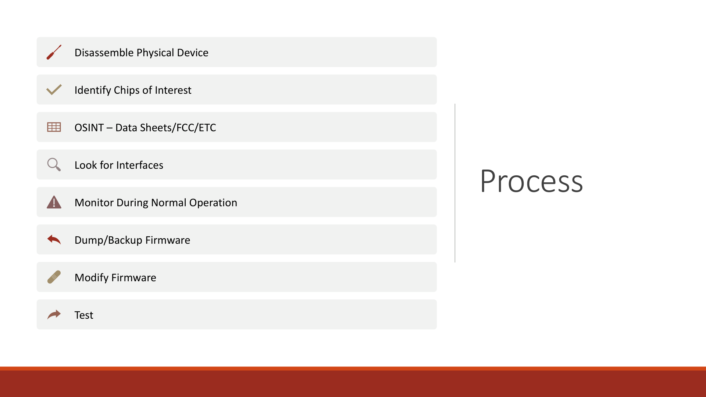

# Chapter 4: The Hardware Hacking Process



Every hardware hack follows the same methodology. It doesn't matter if you're hacking a conference badge, a cheap IoT device, or a commercial product. The process is consistent.

## The Eight-Step Process

### Step 1: Disassemble

Safely take apart the device.

**How:**
- Look for screws (under stickers, in battery compartments, under rubber feet)
- Look for glued seams (use a plastic pry tool, not a knife)
- Document with photos (many photos, from different angles)
- Take notes on how pieces fit together
- Keep track of all screws (they're often different sizes)

**What to watch for:**
- Hidden screws under holographic stickers (common on security products)
- Glued enclosures that require heat to separate
- Cables connecting multiple PCBs
- Shields covering sensitive areas

Once open, you can see the internals. Take more photos. You might not need to go deeper, but if you do, you know what's underneath.

### Step 2: Identify Chips

The main microcontroller (MCU) or system-on-chip (SoC) is your target. Look for:
- The largest chip on the board
- Text printed on the chip (model number, date code, etc)
- Often in the center of the board

Common ones you'll encounter:
- **ESP32** or **ESP32-S3** - WiFi/Bluetooth, common in IoT
- **STM32** - ARM Cortex-M, common in consumer electronics
- **NXP** chips - Used in automotive, industrial
- **ATMEL/Microchip** - Popular in DIY projects
- **Realtek** - WiFi modules, switches

Write down the exact model number. Use a microscope if needed to read it clearly.

Also note:
- Power supply chips and voltages
- Flash memory chips (separate from MCU)
- RF modules
- Sensor chips

This information drives everything that follows.

### Step 3: OSINT and Datasheets

Now you search for information about what you found.

**FCC Database:**
- Most devices sold in the US are registered with the FCC
- Go to fccid.io
- Search for the device name or FCC ID (printed on the device)
- Download user manuals, test reports, photos, schematics

**Chip Datasheets:**
- Search "[CHIP_MODEL] datasheet" (e.g., "STM32F103 datasheet")
- Datasheets are usually PDFs from the manufacturer
- Read the pin configuration and memory layout
- Find information about debug interfaces

**GitHub and Open Source:**
- Search for the chip model on GitHub
- Look for similar products' firmware or schematics
- Open-source projects often document interfaces

**Existing Teardowns:**
- Search "device name teardown"
- iFixit has many documented teardowns
- YouTube has hardware teardown videos

Collect all this information. You now know more about the device's internals than most people who designed it.

### Step 4: Find Interfaces

Interfaces are how chips talk to each other. You exploit these to gain access.

**Look for:**
- **Test Points** - Small pads labeled TP1, TP2, etc (sometimes labeled, sometimes not)
- **Header Pads** - Empty holes where headers could be soldered
- **Labeled Silkscreen** - UART, SPI, SWD, JTAG (sometimes labeled clearly, sometimes abbreviated)
- **Unused Pins** - Look at the datasheet to see what each pin does. Unused pins might be disabled interfaces
- **Processor Connections** - Trace where the main chip connects. Memory chips, debug headers, sensors

**Common interfaces:**
- **UART/Serial** - Usually 4 pads (VCC, GND, TX, RX) or 3 (GND, TX, RX)
- **SPI** - 4 wires (MOSI, MISO, CLK, CS) plus power and ground
- **I2C** - 2 wires (SDA, SCL) plus power and ground
- **SWD** - 3 wires (SWDIO, SWDCLK, GND)
- **JTAG** - 4+ wires (TDI, TDO, TCK, TMS, GND)

Use a logic analyzer to probe test points and see if signals are present. If you see activity, you found something.

### Step 5: Monitor Normal Operations

Before you dump or modify anything, observe what the device does normally.

**How:**
- Connect to the UART and watch the boot sequence
- Note what it prints
- Watch for error messages
- Look for information leaks (IP addresses, version numbers, internal notes)
- Monitor SPI traffic while the device runs
- See if there are periodic messages or activities

**Why this matters:**
- You learn the normal state (baseline)
- Debug messages often leak information
- You discover what the device considers normal before you break it
- You understand what to look for when you modify it

**Example:**
A device might print "Loading config from flash offset 0x1000" during boot. Now you know where the config is. You can dump that specific region and analyze it.

### Step 6: Dump Firmware

Once you know where the flash is and what interface it uses:

**SPI Flash:**
```bash
sudo flashrom -p linux_spi:dev=/dev/spidev0.0,spispeed=8000 -r firmware.bin
```

**JTAG/SWD (using OpenOCD):**
```bash
telnet localhost 4444
> halt
> dump_image firmware.bin 0x00000000 0x100000
```

**Over Serial if bootloader exposes it:**
```bash
# Some bootloaders allow sending commands to dump memory
# This is device-specific, check the bootloader output
```

Store multiple copies of the dump. These are valuable.

### Step 7: Modify Firmware

This is where you actually change the device's behavior.

**Common modifications:**
- Change a timeout value (binary search or use disassembler to find it)
- Patch security checks (replace comparison with NOP instructions)
- Modify strings (error messages, IP addresses)
- Add functionality (if you have source code)

**Process:**
1. Load firmware into Ghidra
2. Find the function or value you want to change
3. Determine the memory offset
4. Use a hex editor to modify the binary
5. Re-flash the modified firmware

This is complex and requires reverse engineering skills. Start by observing, then move to simple changes (strings, timeouts), then more complex patches.

### Step 8: Test and Verify

Flash your modified firmware back to the device.

**How:**
```bash
# Using flashrom
sudo flashrom -p linux_spi:dev=/dev/spidev0.0,spispeed=8000 -w modified_firmware.bin

# Using OpenOCD
telnet localhost 4444
> program modified_firmware.bin 0x00000000
```

**Testing:**
- Does the device boot?
- Do your changes have the intended effect?
- Are there side effects?
- Does the device break in new ways?

**Document everything:** What worked, what failed, what you learned.

## Decision Tree: Which Interface to Use

Not every device has every interface. Choose based on what's available:

**If you see 4 pads and the datasheet mentions UART:**
- Use a USB-to-serial adapter
- Connect RX, TX, GND
- Use screen or minicom
- Read the boot console and firmware loading information

**If you see SPI (4 wires) and can identify the flash chip:**
- Use flashrom to dump directly
- No desoldering needed (usually)
- Fastest path to firmware

**If you see SWD or JTAG header:**
- Use OpenOCD with the appropriate adapter
- Can halt the CPU, dump memory, set breakpoints
- More control than SPI but requires more setup

**If there's no obvious interface:**
- Try desoldering the flash chip
- Read it with a programmer
- Re-solder it back on
- This is the hard way but always works

## Real-World Example: Dumping a Smart Switch

You find a cheap WiFi switch ($15 from AliExpress).

1. **Disassemble** - Pop it open (usually plastic shell glued together)
2. **Identify chips** - See an ESP32-S3 and a Winbond W25Q32 flash chip
3. **Search information** - Find the ESP32-S3 datasheet, discover SPI is the standard interface
4. **Find interface** - The SPI pins (MOSI, MISO, CLK, CS) are directly connected to the W25Q32
5. **Monitor normal ops** - Connect UART and watch it boot, see network attempts
6. **Dump firmware** - Use flashrom: `flashrom -p linux_spi -r switch.bin`
7. **Analyze** - Load in Ghidra, find the WiFi password storage, identify security checks
8. **Modify** - Change a check that disallows certain commands
9. **Re-flash** - Write it back with flashrom
10. **Test** - Now the switch responds to commands that it previously ignored

Total time: 2-4 hours for someone experienced, a full day for a first-timer. Total cost: $15 for the switch. You've learned about ESP32, SPI, firmware extraction, reverse engineering, and device modification.

## Common Pitfalls

**Going too fast** - Take photos, test connections, verify before powering on. One mistake can destroy a chip permanently.

**Assuming you can't break it** - You can. Be careful.

**Not documenting** - Write down what you did. Future you will forget. Others want to learn.

**Skipping the observation step** - Watch normal operations. You learn more than you expect.

**Trying to patch without understanding** - Read the code. Understand what it does. Then change it.

**Not keeping backup dumps** - Keep your original firmware dumps. You might need them.

## Conclusion

The process is:
1. Get inside physically
2. Understand what's there
3. Find how to communicate with it
4. Watch it work
5. Extract the firmware
6. Modify it
7. Test your changes

Repeat this enough times, and you develop instincts. You'll start projects knowing roughly what to expect. You'll see a chip and immediately know the available interfaces.

Hardware hacking is a skill. Like any skill, you learn by doing.
