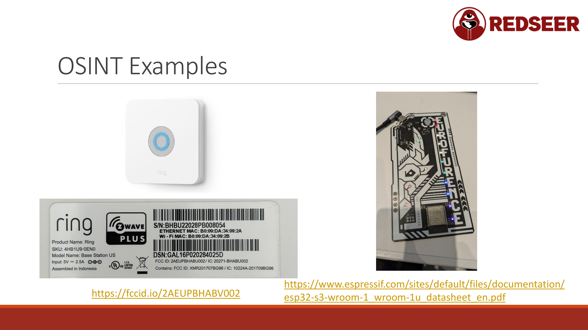

# Chapter 5: OSINT for Hardware: Finding Datasheets and Documentation



OSINT (Open Source Intelligence) is how you find information that's already public but scattered across the internet. For hardware hacking, this means finding datasheets, schematics, teardowns, and FCC documentation.

Good OSINT work can save you hours of reverse engineering. A datasheet tells you exactly what pins do what. FCC filings include internal photos and user manuals. Existing teardowns show you what to expect.

## FCC ID Database

The FCC (Federal Communications Commission) requires all wireless devices sold in the US to be registered. This creates a goldmine of documentation.

### Finding an FCC ID

Look on the device itself:
- Bottom or back of the enclosure
- Inside the battery compartment
- Stamped into the plastic or on a label
- Often says "FCC ID" followed by a code (e.g., "2AOKB-P400")

The first 3 letters are usually the manufacturer's ID. The rest is the device model.

### Searching fccid.io

Go to https://fccid.io/

```
1. Enter the FCC ID in the search box
2. Click the result
3. Browse the filing
```

What you'll find:

- **User Manual** - How the device works, default settings, features
- **Test Report** - How the device was tested for FCC compliance
- **Internal Photos** - High-resolution pictures of the PCB
- **Block Diagram** - How major components connect
- **Schematics** - The actual circuit (if the manufacturer provided it; not always available)
- **Operating Manual** - Technical details for technicians

### Example: Ring Device

Search for a Ring doorbell on fccid.io:
- You see it uses Z-Wave (900 MHz), WiFi, and cellular
- The internal photos show the main MCU and flash chip
- The test report documents all RF frequencies and modules
- The user manual explains how it connects to the network

This tells you immediately: this device has multiple wireless protocols. Hacking one might be harder than hacking another. You know what frequencies to look for.

### Missing Schematics

Many companies do not submit complete schematics to the FCC. They submit only what's required for RF testing. This is common for consumer devices.

When schematics are missing, you can:
- Look at the block diagram (high-level view)
- Study the internal photos (identify components by visual inspection)
- Read the datasheet of the main MCU (it describes the internal pin layout)
- Trace the board by eye (follow where wires and traces go)

## Chip Datasheets

A datasheet is the official document describing how a chip works. It includes everything: pin configuration, electrical characteristics, timing diagrams, and register descriptions.

### Finding a Datasheet

Search Google:
```
[CHIP_MODEL] datasheet filetype:pdf
```

Examples:
- `STM32F103 datasheet filetype:pdf`
- `ESP32-S3 datasheet filetype:pdf`
- `W25Q32 datasheet filetype:pdf`

### Reading a Datasheet

Datasheets are dense but follow a standard structure:

1. **Overview** - What the chip does
2. **Pin Configuration** - Which pin is which (critical!)
3. **Electrical Specifications** - Voltage, current, temperature ranges
4. **Functional Description** - How the chip works internally
5. **Register Maps** - Memory addresses and what they control
6. **Timing Diagrams** - Signal timing for communication
7. **Example Circuits** - How to connect the chip in a real design

For hardware hacking, you need:
- The pin configuration (find debugging interfaces)
- Register maps (find where configuration is stored in memory)
- Communication protocols (understand how to talk to it)
- Memory layout (where is flash? where is RAM?)

### Example: ESP32-S3

The ESP32-S3 is a popular WiFi+Bluetooth SoC. Its datasheet is huge (over 600 pages).

Key sections for hacking:
- **Pin Configuration** - Find GPIO pins, SPI, UART
- **Boot Process** - What happens at startup, boot modes
- **Security Features** - How firmware is verified, encrypted, or protected
- **JTAG and SWD** - Debug interface pins
- **Flash Interface** - How external SPI flash is connected

One datasheets tells you: The SWD pins are GPIO 39 and 40. The SPI flash connects to GPIO 2-7. The UART boot console is GPIO 16-17. Now you know where to connect your probes.

## System-on-Chip Datasheets

Many chips include multiple subsystems:
- ARM CPU core
- Memory controllers
- Peripheral interfaces (UART, SPI, I2C)
- Analog-to-Digital converters
- PWM controllers

A system-on-chip (SoC) datasheet might be 500+ pages. You don't need to read all of it. Focus on sections relevant to your hack:
- Pin configuration
- Debug interfaces
- Memory map
- Boot process

The rest you'll look at if needed.

## CMSIS-SVD Files

ARM provides a standard file format called SVD (System View Description) that describes the memory map of ARM-based chips. These files show:
- Register names and locations
- Bit fields within registers
- What each bit does

Ghidra can load SVD files, automatically adding all register names and documentation to your disassembly.

Where to find them:
- ARM CMSIS repository on GitHub: https://github.com/ARM-Software/CMSIS-SVD
- Chip manufacturer GitHub pages
- Chip vendor documentation

This is an advanced feature for when you're analyzing firmware, but it's incredibly useful.

## GitHub and Open Source

Many devices are reverse-engineered on GitHub.

**Search for:**
```
[device name] firmware
[device name] teardown
[chip model] reverse engineering
```

You might find:
- Existing firmware analysis
- Extracted filesystem contents
- Identified functions and security issues
- Working exploits
- Custom firmware for that device

Others may have solved your exact problem.

## YouTube Teardowns and Reviews

Content creators do detailed teardowns with commentary:
- Matt Brown's hardware hacking channel shows real-world hacking
- iFixit has professional teardown videos
- Many hackers publish their work

Watching someone else hack a similar device teaches you techniques and saves time.

## Ring Doorbell Example

Let's trace a real OSINT investigation:

1. **Start with what you see**
   - Ring doorbell on your doorstep
   - FCC ID label on the back

2. **Search FCC database**
   - Go to fccid.io
   - Search the FCC ID
   - Download internal photos (high-res images of the PCB)
   - Read the operating manual
   - See the block diagram

3. **From the FCC documents, you now know:**
   - Main MCU model (e.g., some version of ARM)
   - Flash chip model (e.g., W25Q128)
   - Wireless modules (Z-Wave, WiFi, cellular)
   - Operating frequencies

4. **Search for MCU datasheet**
   - Google the MCU name
   - Download the official datasheet
   - Read the pin configuration section
   - Find the SPI, UART, and debug pins

5. **Search for Flash datasheet**
   - Google "W25Q128 datasheet"
   - Find that it's a standard Winbond SPI flash chip
   - Learn the exact protocol for reading/writing

6. **Search GitHub**
   - Look for "Ring doorbell reverse engineering"
   - Others may have already figured out vulnerabilities
   - Check if the firmware is accessible

7. **Compile what you know**
   - The SPI flash is directly connected to the MCU (no encryption or access control on the SPI level)
   - You can clip onto the flash chip, read it, and analyze the firmware
   - The firmware might contain credentials, version info, or exploitable code

This entire process takes 30 minutes to 2 hours, depending on how thorough you are. You've done more discovery than 99% of manufacturers expect.

## What You're Looking For

As you dig into documentation, note:

- **Interface Types** - What debugging, communication, or programming interfaces are available?
- **Memory Map** - Where is the firmware stored? Where is the configuration? Where is the filesystem?
- **Security Features** - Are there encryption, signing, or access controls?
- **Default Credentials** - Are there hardcoded passwords or API keys?
- **Known Issues** - Do other people report vulnerabilities?
- **Firmware Updates** - How does the device update? Can you intercept or modify updates?

## Tools for OSINT

### Command Line Tools

```bash
# Search for files on Google (if you can't find them directly)
curl "https://www.google.com/search?q=STM32+datasheet" | grep "filetype:pdf"

# Download from GitHub
git clone https://github.com/ARM-Software/CMSIS-SVD

# Analyze FCC filings (sometimes they're archives)
unzip fcc_filing.zip
ls -la
```

### Browser Extensions

**Google Scholar** - Find academic papers and research related to chip security

**Library Extensions** (browser-based) - Access papers and documentation

### Websites to Bookmark

- **fccid.io** - FCC filings
- **GitHub** - Code and documentation
- **datasheetspdf.com** - Mirror of many datasheets
- **alldatasheet.com** - Another datasheet mirror
- **iFixit** - Device teardowns
- **YouTube** - Video teardowns and hacks

## Legal and Ethical Considerations

Reading publicly available documentation is completely legal. The FCC requires this documentation be public. Datasheets are published by manufacturers.

Using this information to understand your own device is legal and ethical.

Using this to exploit devices you don't own without permission is not. The line is: authorization. Are you authorized to test this device? If yes, go ahead. If not, ask for permission first.

Bug bounty programs are explicit authorization. They say "find bugs in this device, and we'll pay you." Use that as your green light.

## Conclusion

Good OSINT work is 50% of hardware hacking. You find information others missed. You understand the device before you even open it. You know what to expect, where to connect, what to look for.

Spend time on this phase. It pays dividends.

Next: Actually connecting to the device.
