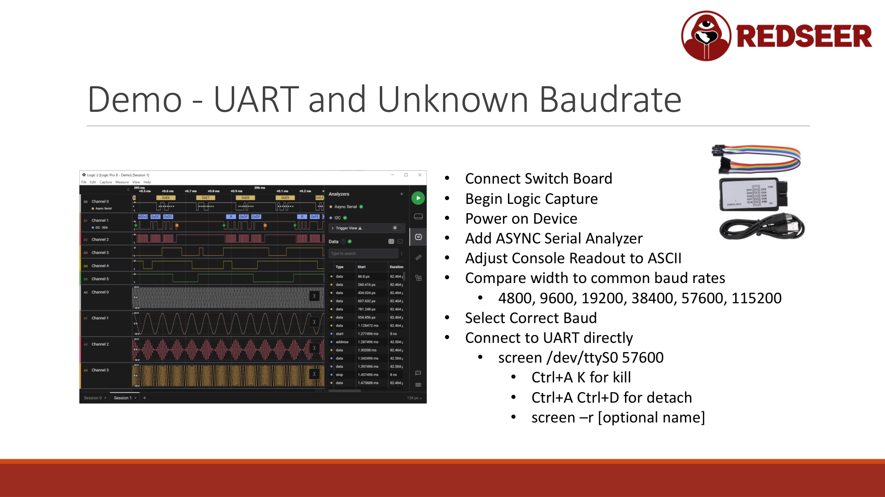

# Chapter 6: UART - Serial Boot Consoles and Debug Output



UART (Universal Asynchronous Receiver/Transmitter) is the simplest and most common debugging interface. It's just serial communication; the same protocol used by old modems.

If you can find the UART port on a device, you can often read the boot console, see debug output, and sometimes send commands to the device.

## UART Basics

UART transmits data as a sequence of bits:
- Start bit (logic low)
- Data bits (typically 8 bits)
- Optional parity bit
- Stop bit (logic high)
- No clock signal (both sides must run at the same speed, the "baud rate")

Common baud rates: 9600, 19200, 38400, 57600, 115200

UART needs just 3 wires:
- TX (transmit) - Data from the device
- RX (receive) - Data to the device
- GND (ground) - Reference

Optionally:
- VCC (power) - Sometimes for powering the device, but usually not needed

## Finding UART on a Device

### Physical Signs

Look for:
- **Header pads** - 4 holes or pads in a row (often unlabeled)
- **Test points** - Labeled TP1, TP2, GND, TX, RX, or similar
- **Silkscreen labels** - Sometimes boards label UART, Serial, Debug
- **Standard locations** - Usually near the main MCU

### Logical Signs

From the datasheet:
- The MCU has dedicated UART pins (e.g., "GPIO 0 = RX, GPIO 1 = TX")
- The datasheet shows the typical pin configuration
- Even if not exposed on the board, the pins might be there

### Probing Method

Use a logic analyzer or oscilloscope:
1. Connect the analyzer to suspected test points
2. Power on the device
3. Watch for activity during boot (you'll see data transitions)
4. UART signals toggle high and low in a characteristic pattern

A logic analyzer can automatically detect the baud rate by measuring the pulse width.

## Connecting to UART

### Hardware Setup

Get a USB-to-serial adapter ($5-15):
- FTDI chip (reliable, widely available)
- CP2102 (also reliable, sometimes cheaper)
- CH340 (works but less reliable)

Connect:
```
Device TX  -> Adapter RX (white wire, usually)
Device RX  -> Adapter TX (green wire, usually)
Device GND -> Adapter GND (black wire)
```

USB-to-serial adapters typically operate at 3.3V logic levels, which matches most modern devices.

**IMPORTANT:** Do not connect VCC pins unless you specifically need to power the device via USB. Wrong voltages destroy chips.

### Software Connection

On Linux, after plugging in the adapter:

```bash
# Find the device
ls /dev/tty*
# You'll see /dev/ttyUSB0 or /dev/ttyACM0 or similar

# Connect with screen
screen /dev/ttyUSB0 115200

# Or with minicom
minicom -D /dev/ttyUSB0 -b 115200
```

Exit screen: Ctrl-A K (confirm with 'y')

## Baud Rate Detection

If you don't know the baud rate, you have two options:

### Option 1: Logic Analyzer Measurement

Capture the UART signal with a logic analyzer:
1. Boot the device
2. Capture a few bytes of output
3. Use the analyzer's protocol decoder (set to UART, asynchronous)
4. The analyzer will show you the baud rate

**Manual calculation:**
- Measure the width of a single bit
- Common baud rates and their bit widths at common sample rates:
  - 9600 baud = ~104us per bit
  - 19200 baud = ~52us per bit
  - 38400 baud = ~26us per bit
  - 57600 baud = ~17us per bit
  - 115200 baud = ~8.68us per bit

### Option 2: Brute Force

Try common baud rates in order:

```bash
screen /dev/ttyUSB0 9600    # If garbage, exit (Ctrl-A K) and try next
screen /dev/ttyUSB0 19200
screen /dev/ttyUSB0 38400
screen /dev/ttyUSB0 57600
screen /dev/ttyUSB0 115200
```

When you get readable output, you've found the right baud rate.

## Analyzing Boot Output

Once connected at the right baud rate, power on the device. You'll see:

```
U-Boot 2021.01 (Dec 12 2022 - 10:30:00 +0000)

CPU:   ...
Board: ...
DRAM:  256 MiB
...
Starting kernel ...
[    0.000000] Linux version 5.10.0 (root@buildhost)
[    0.000000] Command line: console=ttyS0,115200 root=/dev/mmcblk0p2
```

What this tells you:
- The bootloader being used (U-Boot)
- The kernel version
- Boot parameters
- Console device and speed
- Root filesystem location

**Debug messages often reveal:**
- Config file locations
- Firmware loading process
- Network connection attempts
- Error conditions
- Internal IP addresses or hostnames

### Checking for Bootloader Prompts

Some devices allow you to press a key during boot to interrupt:

```
U-Boot 2021.01 ...

Hit any key to stop autoboot: 5
```

Press a key quickly and you get a bootloader prompt:
```
=> printenv
bootargs=console=ttyS0,115200
bootcmd=nand read 0x80000000 0x100000 0x400000; bootm
=> help
```

From the bootloader, you can:
- Read/write memory
- Load firmware from network
- Dump flash contents
- Execute code

This is incredibly powerful. Not all devices allow it, but some do.

## Sending Commands

If the device presents a login or interactive shell:

```
login: root
password: admin
# You're in a shell

# Try these common defaults:
root / password
admin / password
admin / admin
root / root
[blank] / [blank]
```

Many devices have default or no passwords. Others have hardcoded credentials you can find in the firmware.

## Reading and Interpreting Output

Capture the boot sequence to a file:

```bash
screen -L /dev/ttyUSB0 115200
# This creates screenlog.0 in the current directory
# Copy-paste the output when done: Ctrl-A K
```

Or use a script:

```bash
#!/bin/bash
timeout 60 screen -L /dev/ttyUSB0 115200
cat screenlog.0 > uart_boot.txt
```

Analyze what you see:
- What's the device doing during boot?
- What files does it load?
- What network settings does it use?
- Are there any error messages?
- Does it expose any services?

Grep for interesting strings:
```bash
grep -i "config\|password\|secret\|error\|debug" uart_boot.txt
```

## Real-World Example: Dumping a Device Config

Suppose the boot output shows:
```
[    2.345] Loading config from /etc/config.json
[    2.346] Parsing network settings...
[    2.347] Connecting to WiFi: mywifi_5G
```

This tells you:
1. The config file is at /etc/config.json
2. It's in JSON format
3. It contains WiFi credentials

If you get shell access:
```
=> cat /etc/config.json
{
  "ssid": "mywifi_5G",
  "password": "SuperSecret123",
  "server": "analytics.mycompany.com"
}
```

You've found WiFi credentials, an analytics server address, and now you know where the device reports data.

## Enabling More Debug Output

Some devices support verbose logging flags. During bootloader stage, try:

```
=> setenv bootargs console=ttyS0,115200 loglevel=8
=> saveenv
=> boot
```

Or modify boot parameters if firmware allows. More logging reveals more secrets.

## UART Limitations

UART is read-only (mostly). You see what the device outputs. You can send commands, but only if the device expects input.

UART gives you:
- Boot and runtime logs
- Sometimes command prompts
- System information

UART doesn't give you:
- Access to running processes (unless there's a debug shell)
- Memory reading (unless the bootloader exposes it)
- Firmware modification (unless there's a bootloader command)

For deeper access, you need SPI (to read firmware) or SWD/JTAG (to debug and modify).

But UART is often the first and easiest interface. Start here.

## Practical Workflow

1. **Identify test points** - Look for 4 holes in a row, or labeled TP1-TP4
2. **Guess which is TX/RX/GND** - Look at the datasheet, or guess based on location
3. **Connect USB-to-serial adapter** - Wire up TX, RX, GND
4. **Power on the device** - Watch for output
5. **Try common baud rates** - 115200 is most common
6. **Capture output** - screen -L or minicom -C
7. **Analyze** - Look for debug messages, config paths, secrets
8. **Try to gain shell** - Common passwords, hardcoded credentials
9. **Document** - Write down what you find

Time investment: 15-30 minutes for most devices.

## Tools

- **screen** - Built-in Linux terminal multiplexer
- **minicom** - Dedicated serial terminal, nice menus
- **tio** - Modern serial terminal with automatic baud detection
- **picocom** - Minimalist, very fast startup
- **Tera Term** - Windows serial terminal (if not on Linux)

For analyzing captured logs:
- **grep** - Search for interesting strings
- **sed** - Parse structured output
- **python** - Script anything custom

## Next Steps

Once you've read the UART output:
- If you found credentials or config, try to login
- If you found a firmware path, try to access the flash chip and dump it
- If you found a debug prompt, explore it carefully
- If you found nothing useful, move to the next interface (SPI or SWD)

UART is your starting point. It's fast, requires minimal equipment, and often reveals what you need to know next.
