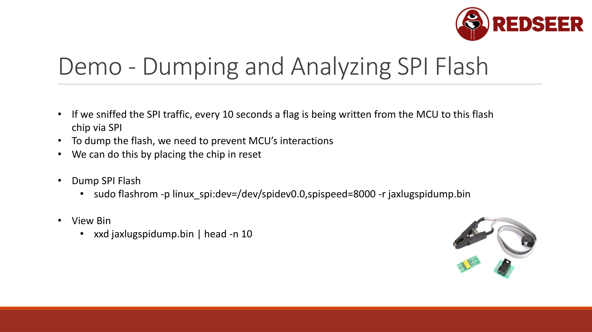

# SPI Flash - Dumping Firmware



SPI (Serial Peripheral Interface) is how microcontrollers talk to external flash memory chips. It's a fast, synchronous protocol with separate clock, data-in, and data-out lines.

If you can connect to the SPI bus, you can dump the firmware without removing the chip from the board. If the firmware is unencrypted (most are), you can then analyze or modify it.

## SPI Basics

SPI uses 4 wires:
- **MOSI** - Master Out, Slave In (data from MCU to chip)
- **MISO** - Master In, Slave Out (data from chip to MCU)
- **CLK** - Clock (synchronization)
- **CS** - Chip Select (enables the chip)

Plus power (VCC) and ground (GND).

The flash chip stores firmware. The MCU reads from it on boot. If you can sniff these signals, you can see what's being read. Better, if the MCU is not accessing the flash, you can read it yourself.

## Finding the SPI Interface

### Physical Signs

Look for:
- **Flash chip** - A small IC labeled W25Q, MX25, GD25, etc (usually near the MCU)
- **Pins labeled MOSI, MISO, CLK, CS** - Sometimes silkscreened
- **Test points** - Often there's a UART and SPI near each other
- **Datasheet reference** - The MCU datasheet shows which pins it uses for SPI

### Standard Pin Positions

Common flash chip packages (from datasheet):
```
W25Q32 (8-pin SOIC):
Pin 1: CS
Pin 2: MISO (DO)
Pin 3: WP (hold low or ignore)
Pin 4: GND
Pin 5: MOSI (DI)
Pin 6: CLK
Pin 7: HOLD (hold high or tie to VCC)
Pin 8: VCC
```

Write these down from the datasheet before you probe.

## Connecting to SPI

### Option 1: Chip Clip

If the flash chip has the right pin spacing, a chip clip attaches directly:

```
1. Identify the flash chip package (usually 8-pin SOIC)
2. Align the clip to pins 1 and 8
3. Close the clip (spring pressure holds it)
4. Connect clip wires to your adapter (MOSI, MISO, CLK, CS, GND, VCC)
5. Verify connection is solid
```

Advantages: No soldering, no desoldering
Disadvantages: Can be unreliable if the clip doesn't grip well

### Option 2: Jumper Wires and Soldering

If you're confident with a soldering iron:

```
1. Solder thin wires to the SPI pins (MOSI, MISO, CLK, CS, GND)
2. Attach the other end of the wires to your adapter
3. Insulate wires so they don't touch each other or the board
```

Advantages: Very reliable
Disadvantages: Requires soldering skills, takes more time

### Option 3: PCBite Probes

These magnetic hooks attach without soldering:

```
1. Place the magnet on one side of the PCB
2. Hook the probe to the signal on the other side
3. Repeat for all signals
```

Advantages: No soldering, reusable
Disadvantages: Requires PCBite probes ($100+), can be finicky

## Preventing MCU Interference

The microcontroller might be trying to write to flash while you're reading. This causes conflicts.

Solution: **Hold the MCU in reset**

```
1. Locate the MCU reset pin (labeled RST, /RESET, or look in the datasheet)
2. Connect a jumper from reset to ground
3. This keeps the MCU from running, so it can't access the flash
4. Now you can read the flash freely

Remove the jumper when done.
```

Alternative: If the MCU boot process writes to flash on startup, disconnect VCC before plugging in your reading adapter. This delays MCU startup, giving you time to read.

## Using Flashrom

Flashrom automatically detects SPI flash chips and can dump or reprogram them.

### Install

```bash
sudo apt install flashrom
```

### Detect Flash Chip

```bash
# List supported chips and detect what's connected
sudo flashrom -p linux_spi:dev=/dev/spidev0.0,spispeed=8000 -L | head -20
```

With the adapter connected to the flash chip, flashrom probes the chip and identifies it:

```
...
Found Winbond flash chip "W25Q32.V" (4096 kB)
...
```

If it doesn't detect, verify:
- All 4 wires (MOSI, MISO, CLK, CS) are connected
- GND is connected
- CS is held low during the read
- VCC is applied to the flash chip
- SPI speed is not too high (start at 8000, increase gradually)

### Dump the Firmware

```bash
# Read the entire flash
sudo flashrom -p linux_spi:dev=/dev/spidev0.0,spispeed=8000 -r firmware.bin

# This takes 1-10 minutes depending on chip size
```

A 4MB chip at 8000 kHz takes about 4 minutes. Be patient.

### Verify the Dump

```bash
# Read it again to verify
sudo flashrom -p linux_spi:dev=/dev/spidev0.0,spispeed=8000 -r firmware_verify.bin

# Compare
diff firmware.bin firmware_verify.bin
```

No difference means your dump is reliable.

## Analyzing the Dump

Once you have the firmware binary:

### Look for Strings

```bash
# Extract printable strings
strings firmware.bin | head -50

# Search for specific patterns
strings firmware.bin | grep -i "password\|secret\|api\|config\|version"
```

You often find:
- Version numbers
- Configuration URLs
- API endpoints
- Hardcoded passwords
- Debug strings

### Hex Dump

```bash
# View the first 512 bytes in hex
xxd firmware.bin | head -20

# Look for magic numbers:
# ELF files start with: 7F 45 4C 46
# GZIP files start with: 1F 8B
# JPEG files start with: FF D8 FF
```

Magic numbers tell you what type of file you have.

### File Analysis

```bash
file firmware.bin
# Output might be: ELF 32-bit ARM executable, ...
```

### Extract Components

If it's a filesystem image:
```bash
binwalk firmware.bin
# This identifies embedded files and filesystems
```

Extract them:
```bash
binwalk -e firmware.bin
# Creates a "_firmware.bin.extracted" directory with contents
```

## Real-World Example: Dumping and Analyzing

Scenario: You have a cheap WiFi switch. You've found the WinBond W25Q32 flash chip.

### Step 1: Connect

Solder jumper wires to MOSI, MISO, CLK, CS, GND:
```
W25Q32 Pin 2 (MISO) -> Adapter MISO
W25Q32 Pin 5 (MOSI) -> Adapter MOSI
W25Q32 Pin 6 (CLK) -> Adapter CLK
W25Q32 Pin 1 (CS) -> Adapter CS
W25Q32 Pin 4 (GND) -> Adapter GND
```

### Step 2: Hold MCU in Reset

Find the MCU reset pin and jump it to ground.

### Step 3: Verify Connection

```bash
sudo flashrom -p linux_spi:dev=/dev/spidev0.0,spispeed=8000 -L | grep -i "found"
# Output: Found Winbond flash chip "W25Q32.V" (4096 kB)
```

### Step 4: Dump Firmware

```bash
sudo flashrom -p linux_spi:dev=/dev/spidev0.0,spispeed=8000 -r switch.bin
# Waiting for SPI controller to finish transfers... OK
# Reading flash... done
```

### Step 5: Analyze

```bash
# Check file type
file switch.bin
# switch.bin: ELF 32-bit ARM executable, ...

# Extract strings
strings switch.bin | grep -i "wifi\|ssid\|password" | head -20
```

You might find:
- Hardcoded WiFi SSID
- Firmware version
- Build date
- API endpoints

### Step 6: Deeper Analysis

Load into Ghidra:
- File > Open As Binary
- Select the file
- When prompted for language, choose ARM (Cortex-M4) or similar
- Let Ghidra auto-analyze

Now you can browse the disassembly, find functions, understand the firmware logic, and plan modifications.

## Troubleshooting

**Problem: "Unable to identify device"**
- Verify all 4 wires are connected
- Check that VCC is supplied to the flash chip
- Try a slower SPI speed: `spispeed=4000`
- Verify CS is working (may need a pull-up resistor)

**Problem: "Read takes forever"**
- Reduce spispeed: `spispeed=4000` or lower
- Check for loose connections
- Verify the adapter supports the chip

**Problem: "Reads are different each time"**
- Connection is unreliable
- Check all solder joints
- If using a clip, reposition it
- Use jumper wires instead of a clip

## Post-Dump Security

Store your firmware dump securely:
- It may contain secrets (API keys, hardcoded passwords)
- It's licensed and protected by the manufacturer
- Use responsibly

## Writing Back Modified Firmware

Once you've modified the firmware (see chapter 09):

```bash
# Write the modified firmware
sudo flashrom -p linux_spi:dev=/dev/spidev0.0,spispeed=8000 -w modified.bin

# Verify
sudo flashrom -p linux_spi:dev=/dev/spidev0.0,spispeed=8000 -r verify.bin
diff modified.bin verify.bin
```

## Next Steps

After dumping firmware via SPI:
1. Analyze it with Ghidra (chapter 09)
2. Identify security checks or timeouts you want to modify
3. Use a hex editor to make precise changes
4. Re-flash with flashrom
5. Test on the real device

SPI is your gateway to firmware modification. Most unencrypted IoT devices are vulnerable to this exact attack.

The good news: As a security researcher, you can responsibly disclose these issues and help manufacturers improve their security.
