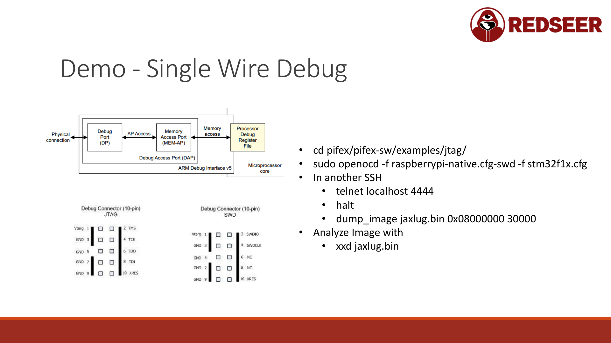

# Chapter 8: SWD and JTAG - Debugging and Control



JTAG and SWD are hardware debugging interfaces built into ARM microcontrollers. Unlike SPI, which only reads flash, these interfaces let you halt the CPU, dump memory, modify registers, and even execute code in real-time.

SWD (Single Wire Debug) is the modern standard. JTAG is older and more wires. Both provide similar capabilities.

## JTAG vs SWD

### JTAG (Joint Test Action Group)

Originally designed for production testing of circuit boards. Later adapted for debugging.

**Pins:**
- **TCK** - Test Clock
- **TMS** - Test Mode Select
- **TDI** - Test Data In
- **TDO** - Test Data Out
- **GND** - Ground
- Optional: TRST (Test Reset)

That's 4 wires plus ground. Older but still supported.

### SWD (Single Wire Debug)

Designed specifically for microcontroller debugging. Simpler, faster, fewer pins.

**Pins:**
- **SWDIO** - Serial Wire Data Input/Output (bidirectional)
- **SWDCLK** - Serial Wire Clock
- **GND** - Ground

That's 3 wires. Smaller footprint, faster than JTAG, the industry standard now.

## Finding JTAG/SWD

### Physical Signs

Look for:
- **Header** - Usually a 10-pin or 20-pin male header
- **Test points** - Labeled as JTAG or SWD, or with pin names (TCK, TMS, TDI, TDO, SWDIO, SWDCLK)
- **Silkscreen** - Sometimes the board silkscreen labels it clearly
- **Empty pad holes** - Designed for a header but none soldered

Common pinouts:
```
ARM Cortex-M SWD Header (standard):
Pin 1: VCC
Pin 2: SWDIO
Pin 3: GND
Pin 4: SWDCLK
Pin 5: GND
Pin 6: SWO (Serial Wire Output, optional)
Pins 7-10: GND or NC
```

### From the Datasheet

Look at the MCU pinout in its datasheet. Look for pins labeled:
- TCO, TCK, TDI, TDO (JTAG)
- SWDIO, SWDCLK (SWD)

## Connecting via OpenOCD

OpenOCD is the standard open-source tool for JTAG/SWD debugging. It provides a unified interface.

### Install

```bash
sudo apt install openocd
```

### Adapter Selection

You need a hardware adapter that converts USB to JTAG/SWD. Options:

1. **PiFex (Raspberry Pi)** - Uses native GPIO (no external adapter)
2. **ST-Link v2** ($5-20 clones) - Works with STM32, many others
3. **Bus Pirate** ($50-100) - Multi-purpose, supports JTAG
4. **J-Link** ($400+) - Professional, most reliable

For learning, a cheap ST-Link clone works. The PiFex is excellent if you have it.

### Configure OpenOCD

Create a config file for your adapter and target. Example for Raspberry Pi + STM32F1:

```
# /etc/openocd/rpi_stm32f1.cfg

# Adapter: Raspberry Pi native GPIO
source [find interface/raspberrypi2-native.cfg]

# Target: STM32F1 with SWD
source [find target/stm32f1x.cfg]
```

Or for ST-Link:
```
# /etc/openocd/stlink_stm32f1.cfg

source [find interface/stlink.cfg]
source [find target/stm32f1x.cfg]
```

### Start OpenOCD

```bash
openocd -f /path/to/config.cfg
```

OpenOCD listens on port 4444 (telnet) and 6666 (gdb).

### Connect via Telnet

```bash
telnet localhost 4444
```

You get a command prompt:
```
Open On-Chip Debugger>
```

## Using OpenOCD Commands

### Halt the CPU

```
> halt
# CPU is now stopped, no code running
```

### Dump Memory

```
# Dump firmware from flash (STM32F1 has 256KB at 0x08000000)
> dump_image firmware.bin 0x08000000 0x40000
# Image dumped from 0x08000000 to 0x08040000

# Dump RAM (STM32F1 has 64KB RAM at 0x20000000)
> dump_image ram.bin 0x20000000 0x10000
```

### Read Registers

```
> reg
# Shows all ARM registers (r0-r15, PC, SP, etc)
```

### Write Memory

```
# Write a 32-bit value to address 0x20000000
> mww 0x20000000 0x12345678
```

### Resume Execution

```
> resume
# CPU continues running
```

## Real-World Example: STM32 Firmware Dump

Scenario: You have an STM32F1 device with SWD header exposed.

### Step 1: Connect

Wire up SWD:
```
Device SWDIO -> ST-Link SWDIO
Device SWDCLK -> ST-Link SWDCLK
Device GND -> ST-Link GND
```

### Step 2: Start OpenOCD

```bash
openocd -f openocd_config.cfg
```

Output:
```
Info: ...
Info: Listening on port 4444 for telnet connections
```

### Step 3: Telnet and Halt

```bash
telnet localhost 4444
> halt
# Target halted, current instruction: 0x08001234 (or similar)
```

### Step 4: Dump the Firmware

```
> dump_image firmware.bin 0x08000000 0x80000
# Image dumped from 0x08000000 to 0x08080000 (512KB)
```

The size depends on the specific STM32 variant (128KB, 256KB, 512KB flash).

### Step 5: Analyze

```bash
# On your main computer, analyze the firmware
file firmware.bin
# firmware.bin: ELF 32-bit ARM executable
```

## Advantages of SWD/JTAG

Compared to SPI:
- No need to hold MCU in reset
- Faster dumps (sometimes)
- Can read RAM contents
- Can halt and inspect CPU state
- Can modify running code (advanced)
- Can set breakpoints and debug in real-time

Compared to UART:
- Full memory access, not just console output
- Direct hardware control
- No reliance on bootloader or OS

## Disadvantages

- Requires specialized adapter (if not using PiFex)
- More complex setup than SPI or UART
- Some devices disable debug interfaces in production
- Requires correct config file for your target chip

## Debugging with GDB

For advanced users, you can use GDB (GNU Debugger) with OpenOCD:

```bash
# Start OpenOCD first (as above)

# In another terminal, start GDB
arm-none-eabi-gdb

# Connect to OpenOCD
(gdb) target remote localhost:3333

# Set breakpoints
(gdb) break main

# Resume execution
(gdb) continue

# Step through code
(gdb) step
(gdb) next

# Inspect variables and registers
(gdb) info registers
(gdb) print variable_name
```

This is real-time firmware debugging on the running hardware.

## Disabling Debug Interfaces

Manufacturers can disable JTAG/SWD in firmware:

```
# In ARM debug control registers, set bits to disable the interface
# This is device-specific
```

However:
- Early-stage glitching (power or clock manipulation) can sometimes bypass this
- Some devices have fuses that can be permanently blown to disable debugging
- But this requires physical access and specialized equipment

For learning and legitimate hardware hacking, assume the interfaces are available. They usually are.

## Security Implications

If a device has SWD or JTAG exposed, an attacker can:
- Read all firmware
- Read all RAM (including secrets and keys in memory)
- Halt and modify the CPU in real-time
- Bypass encryption and signature verification

This is why many manufacturers:
- Disable these interfaces in production firmware
- Blow fuses to permanently disable them
- Encrypt firmware so reading it isn't useful
- Use secure enclaves for sensitive data

As a security researcher, finding enabled interfaces is a major vulnerability. Report it.

## Practical Tips

- Always verify your config file matches your adapter and target
- Start with a simple halt/resume to confirm connection before attempting dumps
- Keep a backup of the original firmware before modifying
- Document the pinout and wire connections for future reference
- Some cheap adapters are unreliable; if you get errors, try a better adapter

## Next Steps

After dumping firmware via SWD:
1. Analyze with Ghidra (chapter 09)
2. Understand the memory layout and critical functions
3. Plan modifications
4. Modify the binary
5. Re-flash (using SWD write capability or re-programming the flash)
6. Debug if needed

SWD/JTAG is powerful but overkill for simple firmware reading. Use it when:
- SPI interface isn't available
- You need to debug code in real-time
- You want to understand the CPU state during execution
- You're modifying code and need to test changes iteratively

For simple "dump and analyze" work, SPI is faster and simpler. Save SWD for when you need the power.
