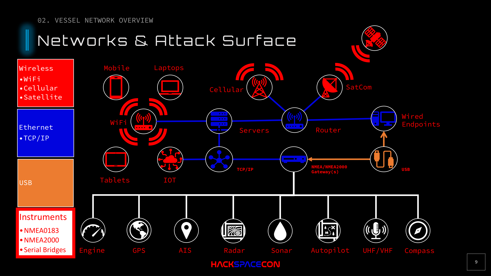

# Vessel Network Overview

## Attack Surface

A vessel's network isn't one network. It's multiple interconnected networks, each with different protocols, trust boundaries, and attack surfaces. The complexity scales with vessel size: a pleasure boat might have a single NMEA 2000 backbone, while a cruise ship has dozens of networks.

## Network Layers

### Wireless Networks
- **WiFi** for crew and passengers
- **Cellular** for internet connectivity
- **Satellite** (VSAT, Iridium, etc.) for ocean connectivity and control channels
- Autonomous vessels always have a control channel back to shore

### Shipboard IP Networks (Ethernet)
Standard TCP/IP networks supporting:
- Crew workstations (Windows, Linux)
- Passenger systems
- Server infrastructure
- Connected to the internet via satellite/cellular uplinks

### Instrument Networks (NMEA)
The critical operational technology layer:
- **NMEA 0183** (legacy serial, point-to-point)
- **NMEA 2000** (CAN bus, multi-device backbone)
- Connected to IP networks via gateways

## Network Diagram

*Networks and attack surface diagram showing the full vessel architecture: wireless (WiFi, cellular, satellite), Ethernet/TCP-IP (servers, router, endpoints, IoT), USB, and the NMEA/NMEA2000 instrument bus connecting GPS, AIS, radar, sonar, autopilot, engine, UHF/VHF, and compass.*

## The Gateway Problem

The NMEA/IP gateway is the critical bridge between IT and OT networks. It can be:

- **Network-attached** (IP gateway on Ethernet, accessible from any device on the network)
- **Software-based** (an endpoint running gateway software)
- **USB-attached** (direct connection to a single host, more secure)

In many installations, the gateway sits on the main Ethernet network with no segmentation. Anything that can reach that IP address can potentially talk to the instrument bus.

## Key Instruments on the Bus

| Instrument | Risk if Compromised |
|-----------|-------------------|
| **GPS** | False position data, navigation errors |
| **Autopilot** | Course deviation, collision risk |
| **Rudder** | Loss of steering control |
| **AIS** | False vessel identity/position broadcast |
| **Radar** | Blind spots, false contacts |
| **Sonar/Depth** | False depth readings, grounding risk |
| **Engine** | RPM/status spoofing, potential shutdown |
| **Compass** | Heading errors compound over distance |
| **Wind** | Critical for sailing vessels |

AIS is essentially ADS-B for boats: it broadcasts vessel identity, position, speed, destination, draft, and more. Spoofing AIS has real-world safety implications.
