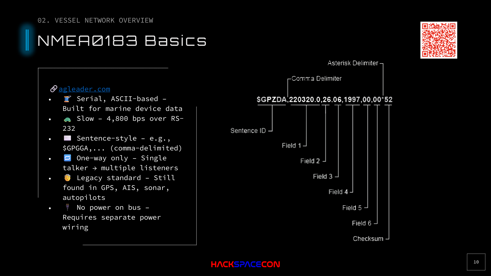

# NMEA 0183



## Overview

NMEA 0183 is the legacy serial protocol for marine instrument communication. It's old, slow, and limited, but still found everywhere.

**NMEA** = National Marine Electronics Association

## Key Characteristics

| Property | Value |
|----------|-------|
| **Type** | Serial, ASCII-based |
| **Speed** | 4,800 bps over RS-232 |
| **Direction** | One-way (single talker to multiple listeners) |
| **Power** | No power on bus (separate wiring required) |
| **Format** | Sentence-style, comma-delimited |
| **Status** | Legacy, but still widely deployed |

## Sentence Format

NMEA 0183 messages are called "sentences." They're human-readable ASCII strings:

```
$GPGGA,123519,4807.038,N,01131.000,E,1,08,0.9,545.4,M,47.0,M,,*47
```

Breaking it down:
- `$GP`  -  Talker ID (GP = GPS)
- `GGA`  -  Sentence type (Global Positioning System Fix Data)
- Comma-separated fields: time, lat, lon, fix quality, satellites, HDOP, altitude...
- `*47`  -  Checksum

## Limitations

- **Point-to-point**: Need two cables for bidirectional communication between two devices
- **No bus**: Can't have multiple talkers on the same wire
- **No power**: Every device needs its own power connection
- **Slow**: 4.8 kbps is painfully limited for modern sensor data
- **No security**: Plain ASCII, no authentication, no encryption

## Where You'll Still Find It

- Older GPS receivers
- Legacy chart plotters and instruments
- Direct serial connections between critical devices (intentional segmentation)
- Bridges from NMEA 0183 to NMEA 2000 via gateways
- Some manufacturers still produce NMEA 0183 devices for compatibility

## Security Implications

If you can tap the serial line, you can read everything. If you can inject, you can override the single talker. The one saving grace is that physical access is required to each individual serial connection, unlike NMEA 2000's shared bus architecture.

Sometimes NMEA 0183 is used intentionally for segmentation: a GPS connected directly to an autopilot via serial, isolated from the main NMEA 2000 bus. This is actually a defensive architecture choice.
