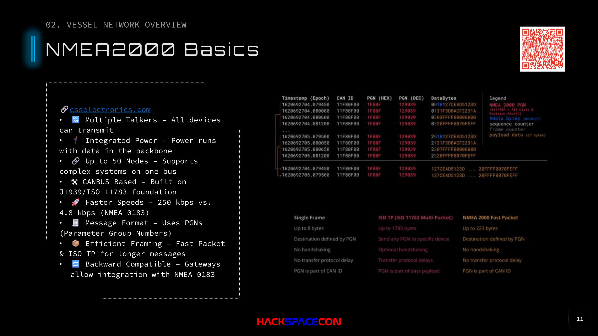

# NMEA 2000



## Overview

NMEA 2000 is the modern standard for marine instrument networks. It's CAN bus with a marine-specific messaging layer on top. This is the primary target for vessel hacking.

## Key Characteristics

| Property | Value |
|----------|-------|
| **Base Protocol** | CAN bus (J1939/ISO 11783) |
| **Speed** | 250 kbps |
| **Direction** | Multi-talker (all devices can transmit) |
| **Power** | Integrated (power + data on backbone) |
| **Max Nodes** | 50 (expandable with some tweaks) |
| **Messaging** | PGNs (Parameter Group Numbers) |
| **Connectors** | Standardized, waterproof, ruggedized |

## Why It Matters for Hackers

NMEA 2000 is CAN bus. Full stop. Everything you know about CAN bus hacking applies:

- **No authentication** on the bus
- **No encryption** of messages
- **Full trust** for any connected node
- **Broadcast architecture** (every node sees every message)
- Physical access to the bus = game over

## Frame Structure

### Single Frame (Standard)
A single NMEA 2000 frame carries up to 8 bytes of data (standard CAN frame size).

### Fast Packet (Multi-frame)
For larger messages, NMEA 2000 uses a sequence counter and frame counter:

```
[Sequence Counter] [Frame Counter] [Data...]
```

- Frame counter increments for each frame in the sequence
- Supports up to 223 bytes per message
- ISO TP available for even larger payloads (rarely used)

## The Backbone

The NMEA 2000 backbone is the physical bus:

```
[Terminator]──[T-Connector]──[T-Connector]──...──[Terminator]
                    │              │
                  [GPS]        [Autopilot]
```

- T-connectors branch devices off the backbone
- Bus must be terminated at both ends
- Connectors are standardized across vendors (plug-and-play)
- Waterproof and ruggedized for marine environments

### Pin Out

| Pin | Function |
|-----|----------|
| 1 | Shield/Drain |
| 2 | NET-S (Power Supply) |
| 3 | NET-C (CAN High) |
| 4 | NET-H (CAN Low) |
| 5 | NET-L (Power Ground) |

For CAN hacking, you need pins 3 (CAN High) and 4 (CAN Low). That's it.

## NMEA 2000 Gateway Access

Many vessels expose the NMEA 2000 bus to the IP network via a gateway. These gateways:

- Sit on the Ethernet network (reachable by IP)
- Translate between NMEA 2000 PGNs and IP protocols
- May provide web interfaces for configuration
- Sometimes run their own WiFi hotspot

If you can reach the gateway from the ship's network, you don't need physical access to the bus.
