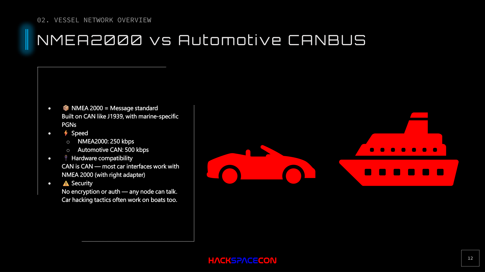

# NMEA 2000 vs Automotive CAN Bus

## The Key Insight

If you've done any car hacking, you already know how to hack boats. NMEA 2000 IS CAN bus with a different messaging layer on top.

## Comparison

| Property | Automotive CAN | NMEA 2000 |
|----------|---------------|-----------|
| **Base Protocol** | CAN 2.0 | CAN 2.0 (J1939/ISO 11783) |
| **Bus Speed** | 500 kbps | 250 kbps |
| **Messaging** | Manufacturer-specific | PGNs (proprietary, reverse-engineered) |
| **Authentication** | None | None |
| **Encryption** | None | None |
| **Connectors** | OBD-II (standard diagnostic port) | NMEA 2000 micro/mini connectors |
| **Physical Access** | Under the dashboard | On the backbone or via gateway |

## What This Means

### Hardware Compatibility
CAN is CAN. Most automotive CAN interfaces work with NMEA 2000 as long as you can:
1. Set the bus speed to 250 kbps (instead of automotive 500 kbps)
2. Access CAN High and CAN Low lines

OBD-II connectors have CAN High and CAN Low on standardized pins. If you have a CAN interface with an OBD-II plug, you can cut it off and solder to the NMEA 2000 backbone.

### Software Compatibility
CAN libraries (python-can, SocketCAN, etc.) work identically. The only difference is how you encode and decode the message payloads:
- Automotive: manufacturer DBC files
- NMEA 2000: PGN definitions (reverse-engineered, see [canboat](https://github.com/canboat/canboat))

### Attack Techniques Transfer Directly
Everything from automotive CAN bus research applies:
- Bus flooding/DoS
- Message injection/spoofing
- Replay attacks
- Man-in-the-middle via inline devices
- Address/arbitration attacks
- Fuzzing

## The Speed Difference

The only technical gotcha: NMEA 2000 runs at 250 kbps, not 500 kbps. If your interface doesn't let you configure the bus speed, it won't communicate. Most modern CAN interfaces (including cheap USB ones) support configurable bitrates.

## Security Comparison

Both automotive and maritime CAN share the same fundamental security flaw: **implicit trust**. Any device on the bus is trusted. There's no concept of authentication, access control, or message integrity.

The automotive industry is (slowly) moving toward CAN FD, CAN XL, and Automotive Ethernet with security layers. The maritime industry is even further behind. The proposed fix is "migrate to Ethernet," but that means rewiring vessels that have been in service for decades.

Realistic timeline for industry-wide maritime CAN security: 20+ years.
