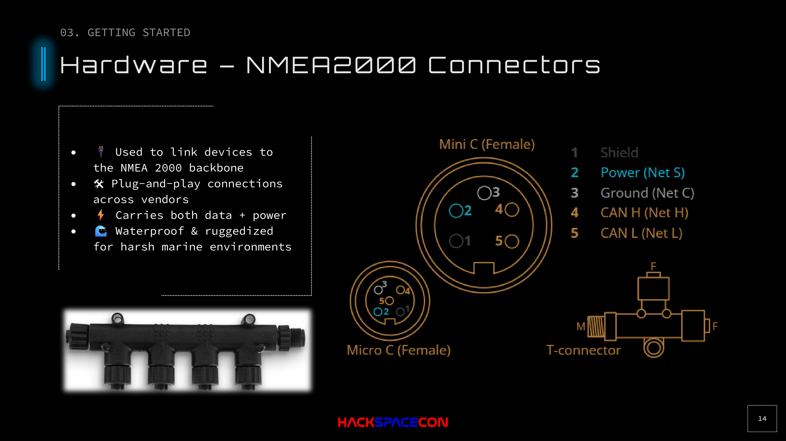
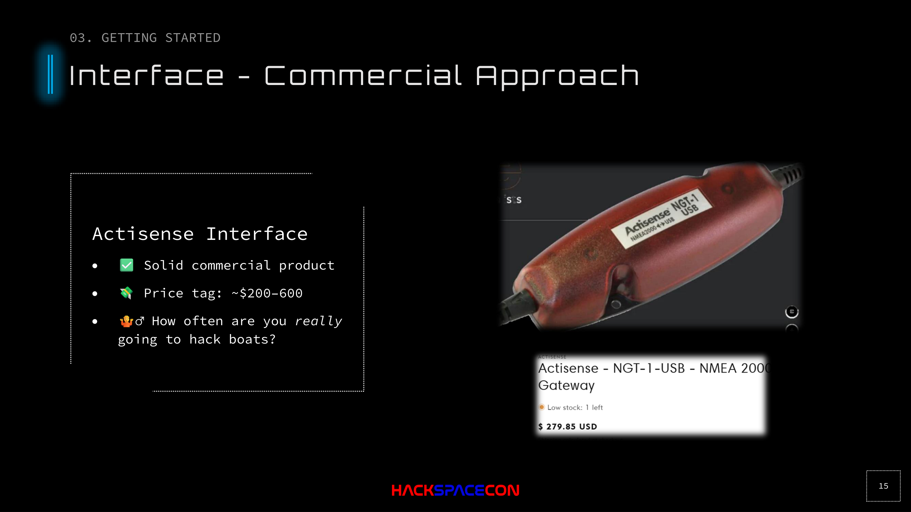
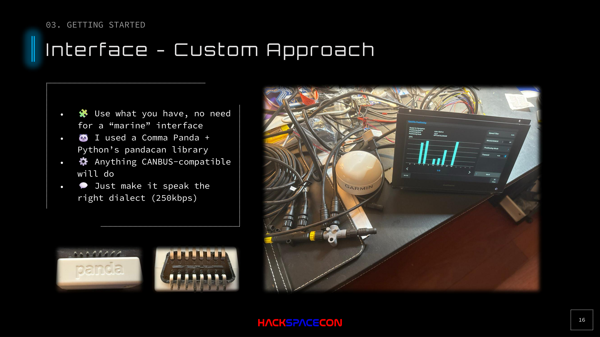
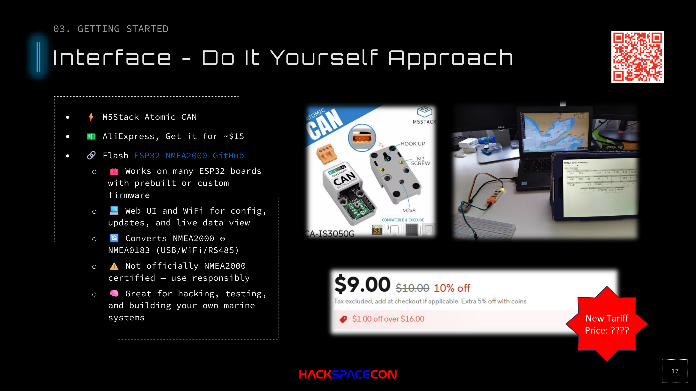

# Hardware Interfaces

## Overview

To interact with an NMEA 2000 bus, you need a CAN interface. There are three approaches: commercial (expensive, polished), custom (use what you have), and DIY (cheap, open source, recommended).

## Approach 1: Commercial (Actisense)

[Actisense](https://actisense.com) makes commercial NMEA 2000 gateways.

| Pros | Cons |
|------|------|
| Solid, well-tested products | $200-600 price range |
| Industry standard | Proprietary software ecosystem |
| Wide software compatibility | Overkill for security research |

Unless you need a certified marine gateway or want to support the company, there are better options for hacking.

## Approach 2: Custom (Use What You Have)

Any CAN bus interface that supports 250 kbps will work. If you already have automotive CAN tools, start there.

### Example: Comma AI Panda

The [Comma AI White Panda](https://comma.ai) is an automotive CAN interface designed for self-driving car development. It works for NMEA 2000 with modifications:

- **Interface**: USB CAN adapter with OBD-II connector
- **Modification**: Cut off OBD-II connector, solder CAN High/CAN Low to NMEA 2000 backbone
- **Software**: Python `panda` library
- **Speed config**: Set to 250 kbps

### OBD-II Pin Reference (for CAN)

If you're repurposing an OBD-II connector:
- **Pin 6**: CAN High
- **Pin 14**: CAN Low

### Other Compatible Interfaces

- Peak PCAN-USB
- Kvaser Leaf Light
- CANable / CANable Pro (open source)
- Any SocketCAN-compatible adapter

**Key requirement**: The interface must let you set the bus speed to 250 kbps.

## Approach 3: DIY (Recommended)

### M5Stack Atomic CAN Base

**This is the recommended approach for getting started.**

| Property | Value |
|----------|-------|
| **Device** | M5Stack Atomic CAN Base |
| **Price** | ~$15 (AliExpress) |
| **MCU** | ESP32 |
| **Firmware** | [ESP32 NMEA2000](https://github.com/AK-Homberger/NMEA2000-AIS-Gateway) or similar |
| **Features** | WiFi hotspot, web UI, CAN transceiver built-in |

What makes this great:

- **Cheap**: $15 vs $200+ for commercial options
- **WiFi**: Connect from your phone or laptop wirelessly
- **Web UI**: View and modify CAN messages from a browser
- **Open source firmware**: Full control over behavior
- **Actisense-compatible**: Works with any software that supports Actisense protocol
- **Bidirectional**: NMEA 0183 to NMEA 2000 gateway capability
- **Compact**: Tiny form factor, easy to conceal or mount

### Firmware

Flash with [ESP32 NMEA2000](https://github.com/AK-Homberger/NMEA2000-AIS-Gateway) or similar open-source projects:

- Web UI for configuration and live data viewing
- WiFi hotspot for wireless access
- Converts between NMEA 0183 and NMEA 2000
- USB, WiFi, and RS-485 output options
- Not officially NMEA 2000 certified (use responsibly)

### Other ESP32 Options

Really, any ESP32 board with a CAN transceiver works. The M5Stack Atomic CAN is just the easiest path because the transceiver is built in.

## Feedback Devices

You need something to verify your attacks are working. Options:

### Physical Chart Plotter
- Garmin, Raymarine, or similar
- Shows real-time instrument data
- Visual confirmation of spoofed data
- Can find used/cheap units for lab use

### Software Chart Plotter
- OpenCPN (free, open source)  -  see [Software chapter](./07-software.md)
- Connects via NMEA gateway or virtual serial
- Great for lab environments

**Important**: You need a feedback loop. You can't hack what you can't observe. Whether it's a physical display or software target, make sure you can see the results of your actions on the bus.

### Hardware Hacking Note

If using a chart plotter with a built-in GPS: some devices have boot checks that verify internal hardware. Disabling the internal GPS chip (to force reliance on external bus data) can brick the device if the firmware checks for it during boot. Test on spare hardware.
