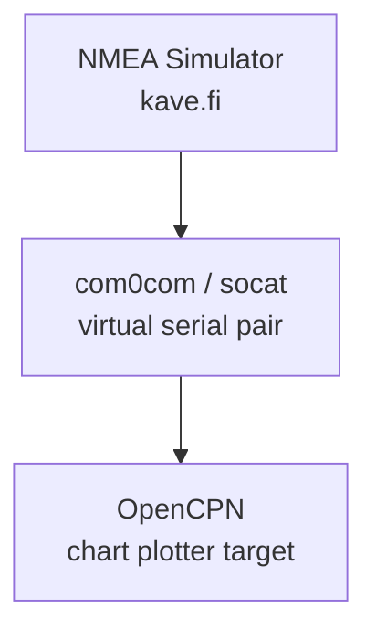
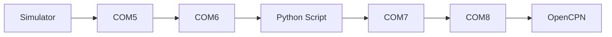
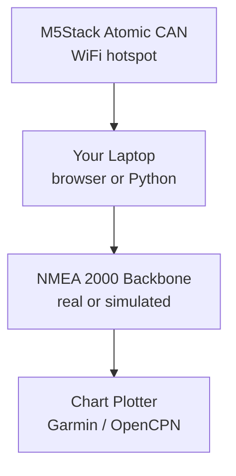

# Software & Simulators

## Simulators

Simulators let you generate realistic NMEA data without a physical vessel. Essential for:
- Learning protocol structure
- Developing exploits at home
- Testing chart plotter behavior
- Understanding what normal traffic looks like before going on-site

### NMEA 2000 Simulator (kave.fi)

**Recommended simulator.**

- **URL**: [kave.fi/Apps](https://www.kave.fi/Apps)
- **Platform**: Windows
- **Protocol**: NMEA 0183 and NMEA 2000
- **License**: Free (limited: 5K messages, 2 highlights, 100 parsed N2K). Commercial version available.

Features:
- Send and receive NMEA 0183 and NMEA 2000 messages
- Message filtering, highlighting, playback, and analysis
- GPS satellite emulation
- Device list, address claiming, and bus monitoring
- At-anchor simulation (realistic GPS drift)
- Engine, compass, wind, depth simulation
- Configurable parameters per virtual device

### NMEASimulator

- **URL**: [github.com/panaaj/nmeasimulator](https://github.com/panaaj/nmeasimulator)
- **Platform**: Windows, Mac, Linux
- **Protocol**: NMEA 0183, Signal K

Features:
- Delta-based vessel movement with manual override
- Follow GPX/KML tracks
- Replay recorded logs
- Simulates vessel motion, depth, engine data, and more
- Signal K data stream support

## Targets (Chart Plotters)

You need something to receive and display your simulated/spoofed data.

### OpenCPN (Recommended)

**Free, open-source chart plotter.**

- **URL**: [opencpn.org](https://opencpn.org)
- **Platform**: Windows, Mac, Linux
- **License**: Open source (GPLv2)

Why it's great for hacking:
- Real chart plotter used by actual boaters
- Accepts NMEA 0183 and NMEA 2000 input
- Visual feedback for position spoofing, heading changes, etc.
- Plugin ecosystem for extended functionality
- Free and actively maintained

### Coastal Explorer

- **URL**: [rosepoint.com/coastal-explorer](https://www.rosepoint.com/coastal-explorer)
- **Platform**: Windows
- **Price**: $399
- **Use case**: If you need commercial-grade chart plotting

Also sells the Nemo interface ($729) for NMEA 0183/2000 connectivity. Not recommended for hacking (OpenCPN does the job for free).

## Virtual Serial (Connecting It All)

### com0com (Windows)

Virtual serial port bridge. Creates paired COM ports (e.g., COM5 <-> COM6) for connecting software without physical hardware.

**Use cases:**
- Route simulator output to chart plotter input
- MITM: intercept and modify NMEA 0183 data in transit
- Connect multiple tools to the same data stream
- Develop and test without any hardware

### socat (Linux/macOS)

The Unix equivalent:

```bash
socat PTY,link=/dev/ttyS98 PTY,link=/dev/ttyS99
```

Creates a virtual serial pair. Feed data into one, read from the other.

## Putting It Together: Lab Setup

A complete home lab with zero hardware:



Add attack scripts in the middle for MITM testing:



Or with a physical interface:


