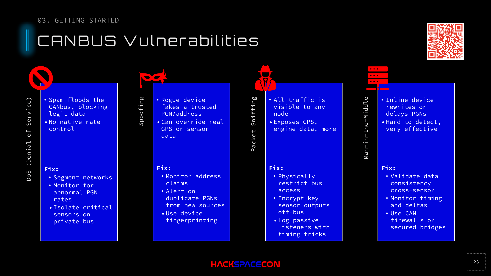

# CAN Bus Vulnerabilities

## Overview

CAN bus, whether in a car or a vessel, has no native security. Once you're on the bus, you're a trusted node. These are the four primary attack categories.

## 1. Denial of Service (DoS)

### Attack
Flood the CAN bus with traffic, blocking legitimate data from being processed.

- Spam arbitrary PGNs at high rate
- Spoof address claims to knock devices off the bus
- No native rate control on CAN bus

### Impact
- Instruments lose data (GPS, depth, heading go blank)
- Autopilot loses input
- Chart plotters show stale or no data
- All lines go flat: first sign of success

### Defenses
- Segment networks: isolate critical sensors on a separate bus
- Monitor for abnormal PGN rates
- Use NMEA 0183 direct serial for critical device pairs (intentional segmentation)
- CAN bus firewall appliances (expensive, commercial)

## 2. Spoofing

### Attack
A rogue device fakes being a legitimate device on the network. Uses the ISO Address Claim mechanism to take over another device's address.

- Claim the address of a real GPS receiver
- Send fake position data as if you ARE the GPS
- Override real sensor data with attacker-controlled values

### Impact
- False GPS position (drift the vessel, teleport it on charts)
- False heading data (autopilot follows wrong course)
- False depth readings (vessel runs aground)
- False AIS data (other vessels see wrong information)

### Defenses
- Monitor address claims and alert on changes
- Alert on duplicate PGNs from new sources
- Device fingerprinting using timing analysis
- Compare data across multiple independent sensors

## 3. Packet Sniffing

### Attack
All CAN bus traffic is visible to every node. Any device on the bus can read all messages.

- Passive monitoring requires no transmission
- Capture GPS coordinates, speed, heading, engine data
- Build complete picture of vessel operations

### Impact
- Position tracking (even if AIS is disabled)
- Operational intelligence gathering
- Engine status, fuel levels, speed data
- Crew activity patterns

### Defenses
- Physically restrict bus access (lock connector panels)
- Encrypt sensitive sensor outputs off-bus
- Monitor for passive listeners using timing analysis
- Regular physical inspection of bus connections

## 4. Man-in-the-Middle (MITM)

### Attack
Place an inline device that intercepts and modifies PGNs as they pass through.

- Intercept speed data, modify it, pass it on
- Delay critical PGNs (stale data is dangerous data)
- Selectively modify specific instruments while passing others through unchanged
- Hard to detect because traffic still flows

### Impact
- Subtle data manipulation (more dangerous than obvious DoS)
- Gradual course deviation
- Falsified engine data hiding real problems
- Modified depth readings

### Defenses
- Validate data consistency across multiple sensors
- Monitor timing and deltas between expected and received data
- Use CAN firewalls or secured bridges at trust boundaries
- Cross-reference GPS with AIS, compass, and dead reckoning

## Key Takeaway

If you have physical access to the NMEA 2000 bus, you own it. This is identical to having physical access to a server. The bus provides no protection against malicious nodes.

The most realistic defense is **network segmentation**: don't put everything on one bus. Use NMEA 0183 direct serial for critical autopilot/GPS connections. Use CAN bus firewalls at segment boundaries. And most importantly, cross-validate data across independent sensors and communication paths.
