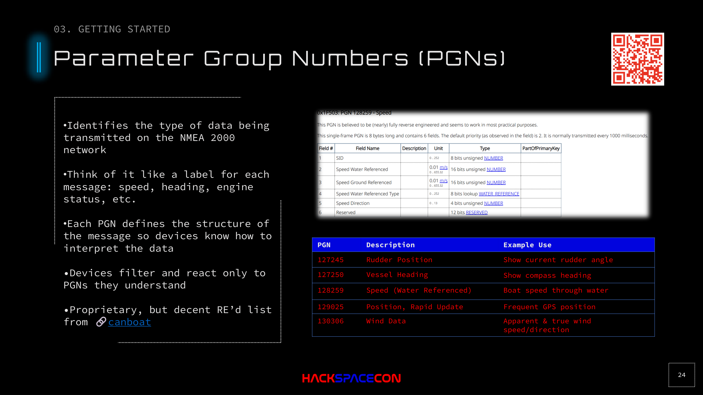

# Parameter Group Numbers (PGNs)



## Overview

PGNs are the messaging format of NMEA 2000. Each PGN identifies a specific type of data being transmitted on the bus. Think of them as labels: this message is GPS position, that message is engine RPM, this one is rudder angle.

## How PGNs Work

- Each PGN defines the **structure** of the message payload
- Devices **filter** PGNs and only process the ones they understand
- A GPS device ignores engine PGNs; an autopilot ignores wind PGNs
- PGN definitions are **proprietary** but have been extensively reverse-engineered

## Key PGN Reference

### Essential PGNs for Hacking

| PGN | Description | Why It Matters |
|-----|-------------|---------------|
| **60928** | ISO Address Claim | Device identity and bus priority. The key to spoofing. |
| **127245** | Rudder Position | Current rudder angle. Spoofing this affects steering displays. |
| **127250** | Vessel Heading | Compass heading. Autopilot relies on this. |
| **128259** | Speed (Water Referenced) | Boat speed through water (not GPS speed). |
| **129025** | Position, Rapid Update | Frequent GPS lat/lon updates. Primary spoofing target. |
| **129026** | COG/SOG Rapid Update | Course and speed over ground. |
| **130306** | Wind Data | Apparent and true wind speed/direction. Critical for sailing. |
| **127488** | Engine Parameters, Rapid | RPM, tilt, trim. |
| **128267** | Water Depth | Depth below transducer. False readings risk grounding. |
| **129038** | AIS Class A Position | Other vessel positions. Spoofing creates phantom ships. |
| **129039** | AIS Class B Position | Same for Class B AIS transponders. |

### Speed Note

There are multiple speed PGNs because maritime speed is complex:
- **Speed through water** (STW): measured by a hull-mounted sensor in the water
- **Speed over ground** (SOG): calculated from GPS position changes

The water is moving. Speed through water and speed over ground can differ significantly due to currents. Both are important for navigation.

## PGN Structure Example

PGN 128259 (Speed, Water Referenced):

```
Field 1: SID (Sequence ID)
Field 2: Speed Water Referenced (in 0.01 m/s)
Field 3: Speed Ground Referenced (in 0.01 m/s)  
Field 4: Speed Water Referenced Type
Field 5: Speed Direction
```

Each field has a defined bit length, offset, and scaling factor. The [canboat](https://github.com/canboat/canboat) project provides comprehensive PGN definitions.

## The Canboat Project

**Essential resource**: [github.com/canboat/canboat](https://github.com/canboat/canboat)

Canboat is the definitive reverse-engineered database of NMEA 2000 PGNs. It includes:
- Complete PGN definitions with field breakdowns
- Analyzer tools for decoding raw CAN frames
- Multiple output formats (JSON, CSV, plain text)
- Community-maintained and actively updated

Since NMEA 2000 is a proprietary protocol, canboat is the closest thing to open documentation. Reference it heavily when working with NMEA 2000 data.

## Crafting PGNs

To spoof a device, you need to:

1. **Claim an address** (PGN 60928) with a lower NAME than the target device
2. **Send the appropriate PGN** with your crafted payload
3. **Maintain timing** consistent with the real device's transmission rate

Devices expect PGNs at regular intervals. If your spoofed GPS stops sending, the chart plotter may show a "no data" warning. Keep sending.
