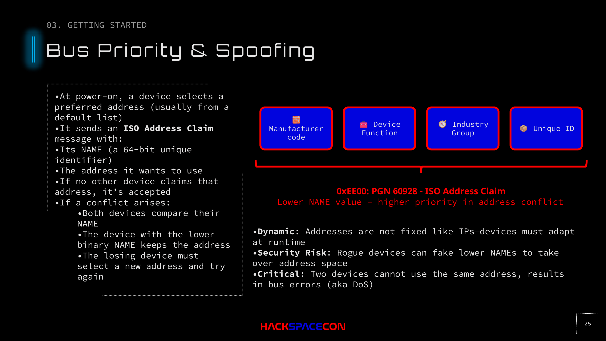

# Bus Priority & Address Claiming



## Overview

NMEA 2000 devices don't have fixed addresses like IP devices. Addresses are negotiated at runtime through the ISO Address Claim process. This dynamic nature is exactly what makes spoofing possible.

## How Address Claiming Works

### 1. Power On
When a device powers on, it selects a preferred address (usually from a stored default).

### 2. ISO Address Claim (PGN 60928)
The device broadcasts an Address Claim message containing:
- Its **NAME**: a 64-bit unique identifier
- The **address** it wants to use (0-253)

### 3. Conflict Resolution
If no other device claims that address: accepted. Done.

If another device is already using that address:
- Both devices compare their **NAME** values
- The device with the **lower binary NAME** keeps the address
- The losing device must select a new address and try again

### 4. Failure
If a device can't find an available address after trying, it goes to address 254 (the "cannot claim" address) and essentially becomes a passive observer.

## The NAME Field

The 64-bit NAME is composed of:

```
┌──────────────────────────────────────────────────────────┐
│ Manufacturer Code │ Device Function │ Industry Group │   │
│                   │                 │                │UID│
└──────────────────────────────────────────────────────────┘
```

| Field | Bits | Description |
|-------|------|-------------|
| Unique Number | 21 | Manufacturer-assigned serial |
| Manufacturer Code | 11 | NMEA-assigned manufacturer ID |
| Device Instance Lower | 3 | Instance differentiation |
| Device Instance Upper | 5 | Instance differentiation |
| Device Function | 8 | What the device does (GPS, autopilot, etc.) |
| Device Class | 7 | Category (navigation, propulsion, etc.) |
| System Instance | 4 | Which system (for multi-system vessels) |
| Industry Group | 3 | Always 4 for marine |
| Arbitrary Address Capable | 1 | Whether device can negotiate addresses |

## Spoofing via Address Claiming

### The Attack

1. **Monitor the bus** to identify target device's NAME and address
2. **Craft a NAME** with a lower binary value than the target
3. **Send ISO Address Claim** (PGN 60928) requesting the target's address
4. **Win the arbitration** because your NAME is lower
5. **Target device is forced** to find a new address
6. **You now control** that address space and can send PGNs as the spoofed device

### Lower NAME = Higher Priority

```
Real GPS NAME:    0x00A0120400000001  (higher value)
Rogue GPS NAME:   0x0000000000000001  (lower value = WINS)
```

The rogue device claims the address, and the real GPS is kicked off.

### What Happens to the Real Device

The real device must find a new address. Depending on implementation:
- It might claim a different address and continue operating (now both devices send GPS data, confusing consumers)
- It might fail to find an address and go silent
- The chart plotter might show conflicting data from both sources

## DoS via Address Claiming

Even without sending valid data, you can DoS by:

1. **Claiming every address**: rapidly claim addresses 0-253, forcing all legitimate devices off the bus
2. **Claiming the same address repeatedly**: force a target device into an endless reclaim loop
3. **Sending conflicting claims**: two rogue devices fighting over the same address creates bus errors

Two devices attempting to use the same address simultaneously causes bus errors (CAN error frames), which is effectively a DoS condition.

## Detection

Address claiming attacks can be detected by:
- Monitoring for unexpected Address Claim messages
- Alerting on NAME changes for known devices
- Tracking address assignment history
- Timing analysis (legitimate devices claim predictably at boot; rogue claims happen mid-operation)

## Key Takeaway

The ISO Address Claim mechanism is the gateway to spoofing on NMEA 2000. It's a protocol feature, not a bug; it was designed for flexibility in plug-and-play marine installations. The designers just never considered adversarial nodes on the bus.

If you can send a single CAN frame with a lower NAME value, you can kick any device off the bus.
